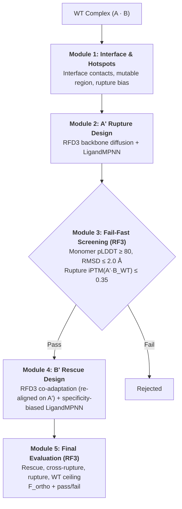

# OrthoPPInterface 🧬🔬

**Automated End-to-End Pipeline for De Novo Orthogonal Protein-Protein Interface Redesign**

OrthoPPInterface is a computational biology framework designed to re-engineer protein-protein interaction (PPI) pairs $(A \cdot B)$ into mutually orthogonal synthetic pairs $(A' \cdot B')$. The designed pair should bind each other while neither component binds the original wild-type counterpart.



---

## 📑 Table of Contents
1. [Theoretical Principles](#theoretical-principles)
2. [Pipeline Architecture (Modules 1–5)](#pipeline-architecture-modules-15)
3. [Experiment Management & Isolated Runs](#experiment-management--isolated-runs)
4. [Installation & Environments](#installation--environments)
5. [Quickstart & Usage](#quickstart--usage)
6. [Configuration Reference (`config.yaml`)](#configuration-reference-configyaml)
7. [Output Files & Database Schema](#output-files--database-schema)
8. [Tests](#tests)
9. [Authors & Acknowledgments](#authors--acknowledgments)

---

## 🧮 Theoretical Principles

### 1. The Orthogonality Problem
Given a native complex $A \cdot B$, the objective is to engineer variants $A'$ and $B'$ such that:
1. **Monomer stability**: $A'$ folds into its native conformation ($\text{pLDDT} \ge 80$, $C_\alpha$ $\text{RMSD} \le 2.0$ Å) — gated in Module 3. $B'$ is judged through the rescue complex (`plddt_rescue`, self-consistency).
2. **Wild-type rupture** $A' \cdot B_{\text{WT}}$: $\text{iPTM} \le 0.35$.
3. **Cross-wild-type rupture** $A_{\text{WT}} \cdot B'$: $\text{iPTM} \le 0.35$.
4. **Synthetic rescue** $A' \cdot B'$: high $\text{iPTM}$ (default $\ge 0.75$, or $\ge 0.85 \times$ the WT ceiling of the same MSA regime, whichever is lower).

### 2. Orthogonality Score ($F_{\text{ortho}}$)

$$
F_{\text{ortho}} = \text{iPTM}(A' \cdot B') - \max\Big(\text{iPTM}(A' \cdot B_{\text{WT}}),\; \text{iPTM}(A_{\text{WT}} \cdot B')\Big)
$$

- $F_{\text{ortho}} > 0$: favourable selectivity over both wild-type cross-reactions.
- The score has **two components of the same shape** (rescue minus the best wild-type cross-reaction), each normalised so that the native complex is 1:
  - $F_{\text{iptm}} = \big(\text{iPTM}(A'B') - \max(\text{iPTM}(A'B_{\text{WT}}), \text{iPTM}(A_{\text{WT}}B'))\big) / \text{iPTM}_{\text{ceiling}}$ (RF3, ceiling = WT/WT under the same MSA masks),
  - $F_{\text{energy}} = b(A'B') - \max\big(b(A'B_{\text{WT}}), b(A_{\text{WT}}B')\big)$ with $b = \Delta G / \Delta G_{\text{native}}$ (PyRosetta interface energy of the *designed* pose),
  - **$F_{\text{ortho}} = w\,F_{\text{iptm}} + (1-w)\,F_{\text{energy}}$** (`energy.weight_iptm`, default 0.5; $F_{\text{iptm}}$ alone when the energy stage is disabled). The raw iPTM margin is kept as `f_ortho_iptm`.
- A design **passes** when rescue, rupture and cross-rupture criteria are met, the energy criteria hold (`min_binding_fraction`: $b(A'B') \ge 0.5$ and `f_energy_min`: $F_{\text{energy}} \ge 0$, both **provisional** until calibrated) and $F_{\text{ortho}} \ge$ `f_ortho_min` (default 0.30). The RF3 and energy measures fail differently, so a design must satisfy both.

### 3. Local MSAs and the information regime (RF3)
RF3 (Foundry, RoseTTAFold-3 All-Atom) receives **one unpaired `.a3m` per chain**; there is no inter-chain pairing. For a designed chain, the WT alignment is adapted so that no evolutionary information is claimed where the sequence was redesigned: the query is replaced by the designed sequence and the alignment columns of mutated positions are handled according to `folding.msa_mask_mode`.

**Why `interface` by default.** A conserved interface in the alignment tells RF3 that a binding site exists, whatever the designed sequence: the MSA then inflates the affinity of any design that keeps the WT shape and of WT partners (`iptm(A'·B_WT)` of one design dropped from 0.57 to 0.21 once the interface of B_WT was masked). Masking the interface columns of both chains removes that evolutionary evidence but keeps the framework signal that stabilises the fold. On the reference system the native complex gives iPTM 0.87 with full MSAs, **0.56** with the interface masked (36 + 41 columns) and 0.26 when the whole 10 Å neighbourhood is masked (too little signal left): the interface-masked WT/WT value is the ceiling to compare designs with. The MSA is kept everywhere else because it makes the framework fold reliably and keeps the predictions cheap. iPTM is never the only criterion: it varies by ±0.05–0.1 between runs and should be complemented by physical interface metrics.

The three orthogonality tests (`A'+B'`, `A_WT+B'`, `A'+B_WT`) must be scored under the **same information regime**, otherwise $F_{\text{ortho}}$ measures MSA asymmetry rather than binding. Key options in `config.yaml → folding`:

| Key | Values | Meaning |
| :--- | :--- | :--- |
| `msa_mask_scope` | `interface` (default) / `diff` / `mutable` | mask the interface columns of both chains **and** the mutated ones (WT and designs alike) / mutated columns only / every redesignable column (legacy) |
| `msa_mask_mode` | `gap` (default) / `substitute` / `keep` | homolog rows get `-` / the designed residue / are left untouched (WT-biased) |
| `negative_msa_regime` | `matched` (default) / `native` | WT partner masked like its designed counterpart / full WT MSA |
| `wt_ceiling_control` | `global` / `per_design` / `off` | WT/WT iPTM in the same regime = `iptm_ceiling`: computed once by module 3 and reused (default), or one fold per design |
| `reuse_module3_rupture` | `true` | A'·B_WT does not depend on B': module 3's iPTM is reused when it was measured in the same MSA regime |
| `strict_msa` | `true` | raise if the alignment width does not match the sequence length |
| `diffusion_batch_size` | `5` | RF3 samples per prediction; the best-ranked one is reported, iPTM mean/std are logged |

RF3 predictions are cached with a **signature** of sequences + MSA contents + inference parameters, so changing the regime never silently re-uses old scores (caches created by earlier versions have no signature and are recomputed).

Choose the regime empirically before a long campaign, on in-silico controls (conservative vs disruptive interface variants of WT chain A folded against $B_{\text{WT}}$):
```bash
python src/calibrate_predictor.py --config config.yaml --analysis_dir runs/<run>/01_analysis
```
If no regime separates the two groups (gap < 0.15), iPTM is not a usable filter for this system and structural metrics must carry the decision.

---

## 🏗️ Pipeline Architecture (Modules 1–5)

### [Module 1: Interface & Hotspot Analysis](src/01_analyze_interface.py)
- Interface residues of chain A: heavy-atom distance to chain B $\le$ `interface_distance_threshold_angstroms` (6.0 Å); redesignable neighbourhood within `neighborhood_radius_angstroms` (6.0 Å) of the interface residues (on the reference system: 36 interface + 51 neighbouring residues = 87 of 224; 10 Å would make half of the protein redesignable, including residues that can never touch B).
- Selects hotspots (charged/polar contact residues), defines mutable vs frozen positions for LigandMPNN.
- Crops chain B to the residues within `crop_chain_B_distance_angstroms` (15.0 Å) of the interface to keep RFD3 within GPU memory.
- Generates the RFD3 contigs (`inputs.json` for the rupture, `inputs_rescue.json` for the rescue), the rupture bias (`mpnn_bias.json`), the fixed-position files and `index_mapping.json`.

### [Module 2: $A'$ Rupture Design](src/02_generate_A_prime.py)
- RFD3 (Foundry) diffusion across `foundry_n_batches` batches, with the interface segments of A regenerated de novo.
- LigandMPNN (one call per backbone) with rupture bias at `temperature_rupture`; the framework of A is frozen. **A' is designed alone** (`ligandmpnn.rupture_apo_design`, default `true`): when B_WT is present in the structure LigandMPNN packs A' against it, a positive design for the wild-type partner (measured `iptm(A'·B_WT)`: 0.38 on average with B present, 0.23 without). LigandMPNN writes **CIF** files, which are converted to PDB and cleaned of NaN atoms; the module stops with an error if LigandMPNN writes nothing (it never falls back to the raw RFD3 backbone). LigandMPNN also writes **no side chain for the residues it redesigns**, so the A' designs are then packed with PyRosetta (`energy.pack_designs`); without it, geometric measures and visualisations only see backbones at the interface.

### [Module 3: Fail-Fast Screening](src/03_filter_A_prime.py)
- **Sanity checks** (`wt_control.json`): the native complex with full MSAs must be recognised (iPTM ≥ 0.6), and the WT/WT iPTM in the configured MSA regime is recorded as the ceiling for designs (warning if < 0.4).
- **Gate 1 (monomer)**: folds $A'$ alone (MSA masked according to `msa_mask_scope`) → pLDDT and $C_\alpha$ RMSD vs WT.
- **Gate 2 (rupture)**: folds $A' \cdot B_{\text{WT}}$ (interface of B_WT masked in the default regime) → iPTM $\le$ `iptm_rupture_max`.
- Writes `metrics_<candidate>.json` and `passed_candidates.txt` (stops after `max_passing_candidates`).

### [Module 4: $B'$ Rescue Design](src/04_generate_B_prime.py)
1. **A' motif selection**: farthest-point selection on the interface sequence (Hamming distance) keeps `max_a_prime_motifs` distinct A' designs.
2. **Frame alignment**: A' is fitted onto the WT frame using the unchanged framework of A.
3. **Backbone co-adaptation**: RFD3 redesigns the interface loops of B around the frozen A'. RFD3 **re-centres its output** (≈70 Å shift observed), so every diffused scaffold is re-fitted onto A' (chain A is identical in all outputs) before any scoring.
4. **Scaffold selection**: scaffolds are filtered (heavy-atom clashes with A', distortion of the fixed framework of B) and de-duplicated (loop backbones must differ by at least `scaffold_min_flex_rmsd`). The rigid native backbone is only used if `include_native_scaffold: true` or as a fallback when nothing passes.
5. **Grafting**: the WT residues of B outside the RFD3 crop (N-terminal head and C-terminal tail) are re-attached after fitting a copy of WT B on the scaffold framework.
6. **Specificity-by-difference bias** for LigandMPNN: at each mutable B position, residues complementary to the *new* A' residue are favoured and those complementary to the *WT* A residue penalised (charge swap, knob/hole). Positions where A' kept the WT residue get a mild generic complementarity bias.
7. **Side-chain packing (PyRosetta)**: every LigandMPNN output is assembled with the fixed A' and its B' side chains are rebuilt against A' (repack + chi minimisation) before anything is measured; the final designs are these packed complexes.
8. **Sampling and selection**: `samples_per_scaffold` sequences per scaffold; designs with more than `max_clashes_with_a_prime` clashes are dropped; the rest are ranked by a rigid proxy (contacts kept with A', contacts lost with $A_{\text{WT}}$) plus the LigandMPNN confidence when it can be read, then `top_k_per_motif` designs are chosen by farthest-point selection **with at least one design per scaffold**.
- Outputs `<A'>_B_cand_NN.pdb` complexes and `diversity_pairs_metadata.json` (parent A', scaffold index, scaffold loop movement, proxy metrics). Cached per motif; use `--force` to recompute.

### [Module 5: Final Evaluation & Database Export](src/05_eval_final.py)
For every designed pair, all four folds are run under the same MSA regime:
- **Rescue** $A' \cdot B'$ and **cross-rupture** $A_{\text{WT}} \cdot B'$ are folded for every design. **Rupture** $A' \cdot B_{\text{WT}}$ and the **WT ceiling** $A_{\text{WT}} \cdot B_{\text{WT}}$ do not depend on B': they are reused from module 3 (same MSA regime), or computed once, instead of once per design.
- **Interface energy (PyRosetta)**, one parallel batch after the RF3 loop: the designed complex $A'B'$ and the two rigid recombinations $A_{\text{WT}}B'$ and $A'B_{\text{WT}}$ (same frame), plus the native complex once, all with the *same* protocol (FastRelax constrained to the start coordinates, then InterfaceAnalyzer). Reported: `dG_*`, binding fractions `b_*`, energy gaps, `dsasa_rescue`, `unsat_hb_rescue`, `f_energy`.
- **Coherence report** (`coherence.json`): rank correlation between RF3 and energy for the three pairs and for the two margins, sign agreement, and the designs where they disagree most. Energy is noisy (relaxation is stochastic; measured std of $F_{\text{energy}}$ ≈ 0.05 across seeds against a spread of 0.22 across designs), so use it for ranking and shortlist repeats, not on single small differences.
- Geometry: $C_\alpha$ RMSD of A' and B' vs WT, DockQ vs the WT crystal and vs the *designed* complex, ligand-RMSD self-consistency of the RF3 prediction vs the design.
- Missing values are `NaN`, never substituted by defaults. **Early exit** (`thresholds.early_exit.rescue_iptm_floor`, default 0.30): a design whose rescue iPTM is at RF3's "no binding" level cannot pass, so it gets no cross/rupture fold and no energy (set 0 to evaluate everything, e.g. to calibrate thresholds).
- Exports `orthogonality_scores.csv`, `results.db`, and (if `openpyxl` is installed) styled `.xlsx` / `.html` reports.

---

## 🗂️ Experiment Management & Isolated Runs

Every experiment runs in its own directory under `runs/` (git-ignored), guaranteeing reproducibility:

```text
runs/
└── run_01_baseline/
    ├── config_used.yaml         # Exact snapshot of all parameters used
    ├── SUMMARY.md / .xlsx / .html
    ├── 01_analysis/             # Contigs, index mappings, MPNN bias, fixed positions
    ├── 02_rupture_design/       # A' candidate PDBs
    ├── 03_fail_fast/            # wt_control.json, metrics_<A'>.json, passed_candidates.txt
    ├── 04_rescue_design/        # <A'>_B_cand_NN.pdb, diversity_pairs_metadata.json, motif_*/ work dirs
    └── 05_final_eval/           # orthogonality_scores.csv, results.db, RF3 outputs per fold
```

---

## 💻 Installation & Environments

### Prerequisites
- **GPU**: NVIDIA GPU with CUDA 12+ (developed and tested on an RTX 5070 Ti, 16 GB).
- **OS**: Linux, or Windows 11 with WSL2 (Ubuntu). Only local execution is supported. On Windows the pipeline runs from a Windows Python environment and calls RF3 through `wsl -d <distro>` (`folding.use_wsl`, default `true` on Windows). RFD3/LigandMPNN wrappers (`OrthoIntRob/bin/rfd3`, `mpnn`) are bash scripts that run inside WSL.

### 1. Python environment
```bash
conda env create -f environment.yml
conda activate orthoppinterface
```
> **Windows note:** always *activate* the environment. Calling its `python.exe` directly (without the conda DLL paths on `PATH`) crashes NumPy linear algebra (`0xc06d007f`).

### 2. Engines
- **RF3, RFD3, LigandMPNN and PyRosetta all live in one WSL/Linux conda environment** (`orthoppinterface`): Python 3.12, PyTorch (cu128), `rc-foundry[all]` (provides `rf3`, `rfd3`, `mpnn`) and `pyrosetta` (from the Rosetta Commons channel), e.g.:
  ```bash
  mamba create -n orthoppinterface -c https://conda.rosettacommons.org -c conda-forge python=3.12 pyrosetta pip
  conda activate orthoppinterface
  pip install torch torchvision torchaudio --index-url https://download.pytorch.org/whl/cu128
  pip install "rc-foundry[all]"
  ```
  Checkpoints (RF3, RFD3, LigandMPNN) resolve from `~/.foundry/checkpoints` by default. `bin/rfd3` and `bin/mpnn` are thin wrappers that activate this environment before running the tool; `folding.rf3_bin` and `energy.python` point into it directly.

---

## 🚀 Quickstart & Usage

### 1. Launching via Master Runner (`run_pipeline.py`)

```bash
# Full pipeline (Modules 1 to 5)
python run_pipeline.py --run_name run_01_baseline

# Custom configuration file
python run_pipeline.py --run_name run_02 --config config_alt.yaml

# Specific steps only (e.g. Steps 4 and 5)
python run_pipeline.py --run_name run_01_baseline --steps 4-5
```

Modules can also be launched individually (e.g. `python src/04_generate_B_prime.py --config ... --force`).

### 2. Before a long campaign
```bash
python src/calibrate_predictor.py --config config.yaml --analysis_dir runs/<run>/01_analysis
```

---

## ⚙️ Configuration Reference (`config.yaml`)

```yaml
pipeline:
  run_name: run_rf3_deep_search
  runs_dir: runs
  input_pdb: data/inputs/complex_S1_S2.pdb
  input_msa_A: data/inputs/S1_chain_A.a3m
  input_msa_B: data/inputs/S2_chain_B.a3m
  chain_A: A
  chain_B: B
  foundry_n_batches: 100               # RFD3 backbones for the A' rupture design
  rescue_diffusion_n_batches: 15       # RFD3 backbones per A' motif for the B' rescue
  max_rescue_scaffolds: 4              # scaffolds kept per motif
  local_rfdiffusion: bash OrthoIntRob/bin/rfd3
  local_ligandmpnn: bash OrthoIntRob/bin/mpnn
  include_native_scaffold: false       # also design on the rigid WT backbone (control)
  scaffold_max_clashes: 5              # RFD3 backbone vs A' heavy-atom clashes tolerated
  scaffold_max_framework_rmsd: 1.5     # max distortion of the fixed framework of B (Å)
  scaffold_min_flex_rmsd: 0.5          # min loop-backbone difference between kept scaffolds (Å)
diversity_selection:
  enabled: true
  max_a_prime_motifs: 8
ligandmpnn:
  checkpoint_path: OrthoIntRob/ligandmpnn/model_params/ligandmpnn_v_32_010_25.pt
  model_type: ligand_mpnn
  temperature_rupture: 0.2
  temperature_rescue: 0.15
  rescue_coadaptation: true
  rupture_apo_design: true             # design A' without B in the LigandMPNN input
  samples_per_scaffold: 60             # LigandMPNN samples per scaffold (min 15 after splitting)
  top_k_per_motif: 6                   # B' designs sent to Module 5 per A' motif (>= 1 per scaffold)
  max_clashes_with_a_prime: 3          # hard filter on LigandMPNN outputs
folding:                               # see "Local MSAs and the information regime"
  engine: rf3
  rf3_bin: /home/<user>/miniforge3/envs/foundry_env/bin/rf3
  rf3_ckpt: /home/<user>/.foundry/checkpoints/rf3_foundry_01_24_latest.ckpt
  use_msa: true
  msa_mask_scope: interface
  msa_mask_mode: gap
  negative_msa_regime: matched
  wt_ceiling_control: global
  reuse_module3_rupture: true
  strict_msa: true
  diffusion_batch_size: 5
  # n_recycles: 10 | num_steps: 200 | wsl_distro: Ubuntu | use_wsl: true   (optional RF3/WSL overrides)
energy:                                # PyRosetta (runs in its own environment, called like RF3)
  enabled: true
  python: /home/<user>/miniforge3/envs/orthoppinterface/bin/python
  n_procs: 16
  pack_designs: true                   # rebuild the side chains LigandMPNN does not write (modules 2 and 4)
  relax_repeats: 1
  seed: 1
  weight_iptm: 0.5                     # F_ortho = w * F_iptm(rel) + (1 - w) * F_energy
  min_binding_fraction: 0.5            # provisional
  f_energy_min: 0.0                    # provisional
structural_constraints:
  interface_distance_threshold_angstroms: 6.0
  neighborhood_radius_angstroms: 6.0
  crop_chain_B_distance_angstroms: 15.0
  max_hotspot_mutations: 3
thresholds:
  monomer_stability: {plddt_min: 80.0, rmsd_max: 2.0}
  negative_design_rupture: {iptm_rupture_max: 0.35}          # A' · B_WT
  negative_design_orthogonality: {iptm_negative_max: 0.35}   # A_WT · B'
  positive_design_rescue:
    iptm_rescue_min: 0.75
    relative_to_ceiling: 0.85          # effective min = min(0.75, 0.85 × WT ceiling of the same regime)
  orthogonality: {f_ortho_min: 0.30}
  early_exit: {rescue_iptm_floor: 0.30} # rescue iPTM below this: no cross/rupture fold, no energy (0 = evaluate everything)
  fail_fast: {max_passing_candidates: 12}
```

The configuration file is read as UTF-8 (a BOM is tolerated) and missing `pipeline`/`thresholds` sections raise an explicit error instead of silently falling back to defaults.

---

## 📊 Output Files & Database Schema

### 1. `orthogonality_scores.csv`
| Column | Description |
| :--- | :--- |
| `design_id`, `parent_a_motif`, `folding_engine` | Pair identifier, A' motif it derives from, engine (`rf3`) |
| `status` | `ok` or `early_exit_low_rescue` |
| `passes` | All criteria met: rescue, rupture, cross-rupture and $F_{\text{ortho}} \ge$ `f_ortho_min` |
| `pass_rescue`, `pass_rupture`, `pass_negative` | Individual criteria |
| `iptm_rescue` | iPTM of $A' \cdot B'$ (best-ranked RF3 sample) |
| `iptm_rupture` | iPTM of $A' \cdot B_{\text{WT}}$ |
| `iptm_negative` | iPTM of $A_{\text{WT}} \cdot B'$ |
| `iptm_ceiling`, `iptm_rescue_rel` | iPTM of WT/WT under the same masks; `iptm_rescue / iptm_ceiling` |
| `f_ortho` | **Combined score** $w F_{\text{iptm}} + (1-w) F_{\text{energy}}$ (native = 1 scale) |
| `f_ortho_iptm`, `f_iptm_rel` | Raw iPTM margin $\text{iPTM}_{\text{rescue}} - \max(\text{iPTM}_{\text{rupture}}, \text{iPTM}_{\text{neg}})$ / the same divided by `iptm_ceiling` |
| `dG_rescue`, `dG_negative`, `dG_rupture`, `dG_native` | PyRosetta interface energy (REU) of $A'B'$, $A_{\text{WT}}B'$, $A'B_{\text{WT}}$ and the native complex |
| `b_rescue`, `b_negative`, `b_rupture` | Binding fractions $\Delta G / \Delta G_{\text{native}}$ |
| `f_energy`, `gap_negative`, `gap_rupture`, `pass_energy` | Energy margin, energy gaps $\Delta G(A'B') - \Delta G(\text{cross})$ in REU (negative = designed pair binds better), energy criteria met |
| `dsasa_rescue`, `unsat_hb_rescue` | Buried surface (Ų) and unsatisfied interface hydrogen bonds of $A'B'$ |
| `iptm_rescue_mean`, `iptm_rescue_std` | Mean / std of the iPTM over the RF3 samples |
| `pae_min_rescue`, `has_clash`, `ranking_score` | RF3 interface PAE minimum (if reported), clash flag, ranking score |
| `plddt_rescue`, `plddt_a_prime` | Mean pLDDT of the rescue complex / monomer pLDDT of A' (Module 3) |
| `rmsd_a_prime`, `rmsd_b_prime` | $C_\alpha$ RMSD of A' / B' (design) vs WT (Å) |
| `rmsd_a_prime_monomer` | Monomer RMSD of A' vs WT (Module 3) |
| `dockq`, `dockq_quality`, `fnat`, `irms`, `lrms` | DockQ of the RF3 rescue prediction vs the WT crystal complex |
| `dockq_vs_design`, `selfcons_lrms`, `pred_interface_contacts` | RF3 prediction vs the *designed* complex (self-consistency), contacts in the prediction |
| `n_mut_A`, `n_mut_B` | Number of mutations vs WT |
| `scaffold_idx`, `scaffold_flex_rmsd` | RFD3 scaffold the B' comes from; movement of its loop backbone vs WT (Å) |
| `proxy_contacts_a_wt`, `proxy_clashes_a_wt` | Module 4 rigid proxy: contacts / clashes of B' with $A_{\text{WT}}$ |

Values that could not be computed are empty (`NaN`); they are never replaced by defaults.

### 2. SQLite Database (`results.db`)
```sql
SELECT design_id, iptm_rescue, iptm_rupture, iptm_negative, iptm_ceiling, f_ortho, rmsd_b_prime
FROM scores
WHERE passes = 1
ORDER BY f_ortho DESC;
```

---

## 🧪 Tests

```bash
pip install pytest
pytest tests
```
The suite covers the sequence/structure helpers, MSA construction, RF3 output parsing and caching, DockQ numbering, and wiring tests of Modules 1 to 5 with RFD3, LigandMPNN and RF3 replaced by fakes (including RFD3's re-centred output frame and LigandMPNN's CIF-only output). It checks plumbing, not scientific quality.

---

## 👥 Authors & Acknowledgments

- **Lead Developer & Research**: [Robin Chatras](https://github.com/robinchatras0-blip)
- **AI Pair Programming & Architecture**: Developed in collaborative pair programming with **Antigravity** (Advanced Agentic AI Assistant, Google DeepMind).

---

## 📜 License & Citation
Developed for advanced computational protein engineering and synthetic biology research.
Distributed under the MIT License (see [`LICENSE`](LICENSE)).
