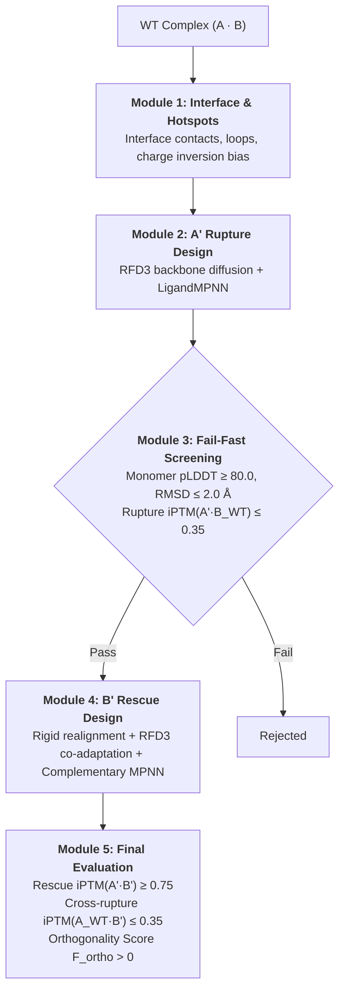

# OrthoPPInterface 🧬🔬

**Automated End-to-End Pipeline for De Novo Orthogonal Protein-Protein Interface Redesign**

OrthoPPInterface is a high-throughput computational biology framework designed to re-engineer protein-protein interaction (PPI) pairs $(A \cdot B)$ into mutually orthogonal synthetic pairs $(A' \cdot B')$. The designed pair binds tightly to each other while neither component interacts with the original wild-type counterparts.



---

## 📑 Table of Contents
1. [Theoretical Principles & Mathematical Framework](#theoretical-principles--mathematical-framework)
2. [Pipeline Architecture (Modules 1–5)](#pipeline-architecture-modules-15)
3. [Experiment Management & Isolated Runs](#experiment-management--isolated-runs)
4. [Installation & Environments](#installation--environments)
5. [Quickstart & Usage](#quickstart--usage)
6. [Configuration Reference (`config.yaml`)](#configuration-reference-configyaml)
7. [Output Files & Database Schema](#output-files--database-schema)
8. [Authors & Acknowledgments](#authors--acknowledgments)

---

## 🧮 Theoretical Principles & Mathematical Framework

### 1. The Orthogonality Problem
Given a native complex $A \cdot B$, our objective is to engineer mutated variants $A'$ and $B'$ satisfying four simultaneous conditions:
1. **Monomer Stability**: Both $A'$ and $B'$ fold into their native monomeric conformations ($\text{pLDDT} \ge 80.0$, $\text{RMSD} \le 2.0\text{ \AA}$).
2. **Wild-Type Rupture ($A' \cdot B_{\text{WT}}$)**: $A'$ has lost affinity for wild-type $B$ ($\text{iPTM} \le 0.35$).
3. **Cross-Wild-Type Rupture ($A_{\text{WT}} \cdot B'$)**: $B'$ has lost affinity for wild-type $A$ ($\text{iPTM} \le 0.35$).
4. **Synthetic Rescue ($A' \cdot B'$)**: $A'$ and $B'$ bind specifically to each other with high affinity ($\text{iPTM} \ge 0.75$).

### 2. Orthogonality Score ($F_{\text{ortho}}$)
The overall quality of a redesign pair is quantified by the Orthogonality Score:

$$
F_{\text{ortho}} = \text{iPTM}(A' \cdot B') - \max\Big(\text{iPTM}(A' \cdot B_{\text{WT}}),\; \text{iPTM}(A_{\text{WT}} \cdot B')\Big)
$$

- $F_{\text{ortho}} > 0$: Favorable orthogonal selectivity over both wild-type cross-reactions.
- $F_{\text{ortho}} \ge 0.40$: Highly selective, benchmark-grade orthogonal interface.

### 3. Zero-Latency Local Hybrid Unpaired MSAs
To eliminate web server bottlenecks and prevent artificial co-evolutionary bias, OrthoPPInterface constructs **block-diagonal unpaired MSAs** directly from local monomer `.a3m` files:
- **Block 1**: Homologs of Chain $A$ with modified positions masked (`-`) and Chain $B$ padded with gaps.
- **Block 2**: Homologs of Chain $B$ with modified positions masked (`-`) and Chain $A$ padded with gaps.
- Multi-chain ColabFold is run in `--pair-mode unpaired`, forcing AlphaFold2 Multimer to evaluate binding strictly based on the physical chemistry of the newly designed sidechains.

### 4. MSA regimes & predictor calibration (RF3)
The three orthogonality tests (`A'+B'`, `A_WT+B'`, `A'+B_WT`) must be scored under the **same information regime**, otherwise `F_ortho` measures MSA asymmetry rather than binding. `config.yaml -> folding` controls it:

| Key | Values | Meaning |
| :--- | :--- | :--- |
| `msa_mask_scope` | `diff` (default) / `mutable` | mask only columns that really differ from WT / every redesignable column |
| `msa_mask_mode` | `gap` / `substitute` / `keep` | homolog rows get `-` / the designed residue / are left WT (biased) |
| `negative_msa_regime` | `matched` (default) / `native` | WT partner masked like its designed counterpart / full WT MSA |
| `wt_ceiling_control` | `true` | folds WT/WT under the same masks -> `iptm_ceiling`, the best iPTM achievable in that regime |

Before a long campaign, choose the regime empirically on in-silico controls (conservative vs disruptive interface variants):
```bash
python src/calibrate_predictor.py --config config.yaml --analysis_dir runs/<run>/01_analysis
```
If no regime separates the two groups (gap < 0.15) iPTM is not a usable filter for this system. RF3 predictions are cached with a signature of sequences + MSA contents + parameters, so changing the regime never silently re-uses old scores. Unit + wiring tests: `pytest tests`.

---

## 🏗️ Pipeline Architecture (Modules 1–5)

### [Module 1: Interface & Hotspot Analysis](src/01_analyze_interface.py)
- Identifies contact residues ($d \le 5.0\text{ \AA}$) between Chain A and Chain B.
- Selects charged and polar interaction hotspots (Arg, Lys, Asp, Glu, His, Tyr, etc.).
- Defines mutable loop segments vs. rigid structural framework.
- Generates RFD3 contig strings with cropped $B[1-88]$ to prevent GPU VRAM OOM.
- Builds the **Soluble Rupture Bias Matrix** for LigandMPNN (charge repulsion, hydrogen-bond inversion, and steric pocket disruption).

### [Module 2: $A'$ Rupture Design](src/02_generate_A_prime.py)
- Runs **RFD3 (Foundry)** diffusion across $N$ batches to sample backbone conformations.
- Converts MMCIF to PDB and cleans incomplete/NaN atom coordinates.
- Runs **LigandMPNN** with sidechain packing and rupture bias at $T = 0.20$.
- Freezes Chain B and all non-interface residues of Chain A.

### [Module 3: Fail-Fast Screening](src/03_filter_A_prime.py)
- **Gate 1 (Monomer Stability)**: Folds $A'$ alone with local `.a3m` $\to \text{pLDDT} \ge 80.0$ and $\text{RMSD} \le 2.0\text{ \AA}$.
- **Gate 2 (Rupture Validation)**: Folds $A' \cdot B_{\text{WT}}$ complex with unpaired `.a3m` $\to \text{iPTM} \le 0.35$.
- Exports passing candidates to `passed_candidates.txt`.

### [Module 4: $B'$ Rescue Design](src/04_generate_B_prime.py)
- **Spatial Realignment**: Superimposes designed $A'$ onto the exact 3D coordinate frame of $A_{\text{WT}}$ ($\text{RMSD} = 0.104\text{ \AA}$).
- **Backbone Co-adaptation**: Runs RFD3 on $B[1-88]$ with frozen $A'$ to allow $B'$ loops to physically pack around mutated $A'$ sidechains.
- **Seamless Grafting**: Re-aligns and attaches the full-length constant domain $B[89-557]$.
- **Complementary Rescue Bias**: Calculates $+5.0$ reciprocal electrostatic steering:
  - $A'^-$ (Asp/Glu) $\to B'^+$ (Arg/Lys)
  - $A'^+$ (Arg/Lys) $\to B'^-$ (Asp/Glu)
  - $A'^{\text{arom}}$ (Phe/Tyr/Trp) $\to B'^{\text{pocket}}$ (Leu/Ile/Val/Tyr)
- Runs LigandMPNN sequence redesign at $T = 0.10$.

### [Module 5: Final Evaluation & Database Export](src/05_eval_final.py)
- Folds positive rescue complex ($A' \cdot B'$) with bipartite interface masking.
- Folds negative cross complex ($A_{\text{WT}} \cdot B'$).
- Calculates structural $C_\alpha$ RMSD for both $A'$ and $B'$ against wild-type crystal structures.
- Computes $F_{\text{ortho}}$ and exports results to [`orthogonality_scores.csv`](results/05_final_eval/orthogonality_scores.csv) and [`results.db`](results/05_final_eval/results.db).

---

## 🗂️ Experiment Management & Isolated Runs

Every experiment runs in its own dedicated, timestamped directory under `runs/`, preventing overwrites and guaranteeing 100% reproducibility:

```text
runs/
└── run_01_baseline/
    ├── config_used.yaml         # Exact snapshot of all parameters used
    ├── SUMMARY.md               # Auto-generated Markdown report with score table
    ├── 01_analysis/             # Contigs, index mappings, MPNN bias matrices
    ├── 02_rupture_design/       # A' candidate PDBs and MPNN fasta outputs
    ├── 03_fail_fast/            # Monomer & complex folding logs, metrics JSONs
    ├── 04_rescue_design/        # Aligned B' designs and co-adapted structures
    └── 05_final_eval/           # Final CSV, SQLite DB, and folded PDB complexes
```

---

## 💻 Installation & Environments

### Prerequisites
- **OS**: Linux / WSL2 (Ubuntu 22.04+).
- **GPU**: NVIDIA GPU (RTX 3070+, RTX 40/50 series, A6000, A100, H100) with CUDA 12+.

### 1. Python Environment
```bash
# Create Conda environment
conda create -n orthoppinterface python=3.10 biopython pyyaml pandas tabulate -y
conda activate orthoppinterface
```

### 2. Self-Contained Local Engines (`OrthoIntRob`)
All deep learning tools (RFD3, LigandMPNN, ColabFold / AlphaFold 2 Multimer) are bundled locally:
```bash
# In WSL2 Ubuntu
bash OrthoIntRob/setup_all.sh
```

---

## 🚀 Quickstart & Usage

### 1. Launching via Master Runner (`run_pipeline.py`)

```bash
# Run full end-to-end pipeline (Modules 1 to 5)
python run_pipeline.py --run_name run_01_baseline

# Run with custom configuration file
python run_pipeline.py --run_name run_02_T02_batches10 --config config_alt.yaml

# Run specific steps only (e.g. Steps 4 and 5)
python run_pipeline.py --run_name run_01_baseline --steps 4-5
```

### 2. Launching via Snakemake

```bash
snakemake --cores 4
```

---

## ⚙️ Configuration Reference (`config.yaml`)

```yaml
pipeline:
  run_name: "run_01_baseline"          # Default run folder name
  runs_dir: "runs"                     # Root directory for experiments
  execution_mode: "local"              # "local", "colab", "hpc", or "mock"
  input_pdb: "data/inputs/complex_S1_S2.pdb"
  input_msa_A: "data/inputs/S1_chain_A.a3m"
  input_msa_B: "data/inputs/S2_chain_B.a3m"
  chain_A: "A"
  chain_B: "B"
  foundry_n_batches: 5                 # Number of RFD3 backbone samples

ligandmpnn:
  temperature_rupture: 0.20            # Higher temperature for diverse rupture exploration
  temperature_rescue: 0.10             # Lower temperature for high-affinity rescue packing
  rescue_coadaptation: true

structural_constraints:
  interface_distance_threshold_angstroms: 5.0
  neighborhood_radius_angstroms: 8.0
  max_hotspot_mutations: 3
  crop_chain_B_distance_angstroms: 15.0

thresholds:
  monomer_stability:
    plddt_min: 80.0
    rmsd_max: 2.0                      # Maximum CA RMSD relative to WT
  negative_design_rupture:
    iptm_rupture_max: 0.35             # Complete dissociation threshold
  positive_design_rescue:
    iptm_rescue_min: 0.75              # High-affinity binding threshold
```

---

## 📊 Output Files & Database Schema

### 1. `orthogonality_scores.csv`
| Column | Description |
| :--- | :--- |
| `design_id` | Unique identifier of the designed pair ($B'$ name) |
| `folding_engine` | Engine used (`rf3`) |
| `status` / `passes` | `ok` or `early_exit_low_rescue` / all criteria met (rescue, rupture, negative, `f_ortho >= f_ortho_min`) |
| `iptm_ceiling` / `iptm_rescue_rel` | WT/WT iPTM under the same masks / `iptm_rescue / iptm_ceiling` |
| `dockq_vs_design`, `selfcons_lrms` | RF3 prediction vs the *designed* complex (self-consistency) |
| `scaffold_idx`, `scaffold_flex_rmsd` | RFD3 scaffold the B' came from, and how far its loop backbone moved from WT |
| `n_mut_A`, `n_mut_B` | Mutations vs WT |
| `iptm_rescue` | Interface PTM for the synthetic complex $A' \cdot B'$ |
| `iptm_rupture` | Interface PTM for $A' \cdot B_{\text{WT}}$ (WT rupture) |
| `iptm_negative` | Interface PTM for $A_{\text{WT}} \cdot B'$ (Cross WT rupture) |
| `f_ortho` | Orthogonality Score ($iPTM_{\text{rescue}} - \max(iPTM_{\text{rupture}}, iPTM_{\text{neg}})$) |
| `plddt_rescue` | Mean pLDDT of the rescue complex |
| `plddt_a_prime` | Monomer pLDDT of redesigned $A'$ |
| `rmsd_a_prime` | $C_\alpha$ RMSD of $A'$ against native $A_{\text{WT}}$ (Å) |
| `rmsd_b_prime` | $C_\alpha$ RMSD of $B'$ against native $B_{\text{WT}}$ (Å) |

### 2. SQLite Database (`results.db`)
Accessible with Python, SQL, or SQLite viewers:
```sql
SELECT design_id, iptm_rescue, iptm_rupture, iptm_negative, f_ortho, rmsd_a_prime, rmsd_b_prime
FROM scores
WHERE f_ortho > 0
ORDER BY f_ortho DESC;
```

---

## 👥 Authors & Acknowledgments

- **Lead Developer & Research**: [Robin Chatras](https://github.com/robinchatras0-blip)
- **AI Pair Programming & Architecture**: Developed in collaborative pair programming with **Antigravity** (Advanced Agentic AI Assistant, Google DeepMind).

---

## 📜 License & Citation
Developed for advanced computational protein engineering and synthetic biology research.
Distributed under the MIT License (see [`LICENSE`](LICENSE)).
